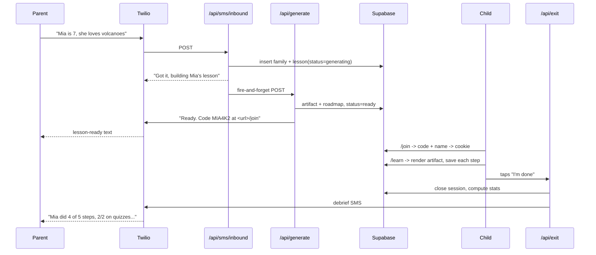

# Kids Learning App — 2-Hour Hackathon Plan

A parent texts a number saying what their child wants to learn. An AI generates a roadmap and one playable lesson. The child opens the site, enters a family code, picks their name, and works through the lesson. Progress is saved. When the child taps "I'm done", the parent gets a text summarizing what the child actually did.

**Constraints:** 120 minutes, 3–4 builders, real SMS on a Twilio trial number. No 10DLC or A2P registration — trial numbers skip it entirely, at the cost of only being able to text numbers you've verified in the Twilio console.

---

## 1. The one rule

**Contracts in the first 10 minutes, then nobody blocks anybody.**

Four people cannot parallelize on a shared codebase unless the seams are agreed up front. Minutes 0–10 are spent together writing three files that everyone else codes against. They contain no logic:

- `src/lib/types.ts` — the `LessonArtifact` and `Progress` shapes.
- `src/lib/fixture.ts` — a hand-written artifact, valid and complete, so the frontend never waits on the AI.
- `schema.sql` — pasted straight into the Supabase SQL editor, not a migration system.

After that, the four streams touch almost disjoint files.

---

## 2. Scope: what actually gets built

**In:** one SMS inbound path, one AI generation call, one lesson with 5 steps, join-by-code, progress save, exit button, one debrief SMS.

**Cut, deliberately:** multiple lessons, the `NEXT` flow, intent classification, signature verification, webhook dedupe, rate limits, RLS, free-response grading, activity steps, session timeout sweeps, roadmap generation for lessons 2+, parent dashboard, auth of any real kind.

The roadmap still appears — the same AI call returns 3–4 lesson titles and the child's page shows them as "coming next". Only lesson 1 is playable. That reads as a roadmap in a demo and costs nothing to build.

---

## 3. Data model: three tables

Paste into the Supabase SQL editor and move on. No RLS, no policies; all access is server-side with the service role key.

```sql
-- schema.sql

create table families (
  id          uuid primary key default gen_random_uuid(),
  phone       text not null unique,          -- E.164, from Twilio
  code        text not null unique,          -- 6 chars, kid types this
  child_name  text not null,
  child_age   int  not null default 8,
  created_at  timestamptz default now()
);

create table lessons (
  id          uuid primary key default gen_random_uuid(),
  family_id   uuid not null references families(id) on delete cascade,
  topic       text not null,                 -- parent's verbatim request
  status      text not null default 'generating',  -- generating | ready | failed
  roadmap     jsonb,                         -- ["Lesson 1: ...", "Lesson 2: ...", ...]
  artifact    jsonb,                         -- LessonArtifact, null until ready
  created_at  timestamptz default now()
);

create table sessions (
  id          uuid primary key default gen_random_uuid(),
  lesson_id   uuid not null references lessons(id) on delete cascade,
  progress    jsonb not null default '{"completed":[],"answers":{},"reflection":""}',
  started_at  timestamptz default now(),
  ended_at    timestamptz,
  debrief     text
);
```

`progress` as a single JSONB blob replaces the append-only event log from a production design. It is one `UPDATE` per step instead of an insert plus a replay function, and it holds everything the debrief needs:

```ts
type Progress = {
  completed: string[];                                    // step ids
  answers: Record<string, { choice: number; correct: boolean }>;
  reflection: string;
};
```

---

## 4. The artifact

Five steps, three types. Every type dropped is a component nobody has to build.

```ts
// src/lib/types.ts

export type Step =
  | { id: string; type: "explain"; title: string; paragraphs: string[] }
  | { id: string; type: "quiz"; question: string; choices: string[]; correctIndex: number; explanation: string }
  | { id: string; type: "reflect"; prompt: string };

export type LessonArtifact = {
  lessonTitle: string;
  steps: Step[];        // aim for 5: explain, quiz, explain, quiz, reflect
  wrapUp: string;
};
```

Generate with the AI SDK's structured-output call against a Zod mirror of this type, with **one** retry and no clever repair logic. If it fails twice, set `lessons.status = 'failed'` and text the parent an apology. Use a fast model (Haiku-class) — a 5-step artifact is small, and speed matters more than prose quality at demo scale.

---

## 5. Handling the latency without fighting the framework

Generation takes 10–25 seconds. Twilio gives the webhook well under 15 before it errors. The cheapest safe pattern, and the one that avoids depending on any particular Next.js background-work API:

```ts
// src/app/api/sms/inbound/route.ts

/**
 * Twilio inbound webhook. Creates the family and lesson rows, kicks off
 * generation in a separate request, and replies immediately so Twilio
 * never sees a timeout.
 */
export async function POST(req: Request) {
  const form = await req.formData();
  const phone = String(form.get("From"));
  const body = String(form.get("Body"));

  const { family, lessonId } = await createFamilyAndLesson(phone, body);

  // Fire-and-forget: a second HTTP request is its own invocation, so this
  // survives us returning right now. Intentionally not awaited.
  void fetch(`${process.env.APP_URL}/api/generate`, {
    method: "POST",
    headers: { "content-type": "application/json" },
    body: JSON.stringify({ lessonId }),
  });

  return twiml(`Got it. Building ${family.child_name}'s lesson now - one minute.`);
}
```

`/api/generate` does the model call, writes `artifact` and `status='ready'`, then sends the second SMS with the join code and URL. Two dead-simple routes, no queue, no cron, no framework-version risk.

---

## 6. Twilio setup — start this at minute 0

This is the longest-lead item and the only one that can't be rushed at the end. One person owns it and starts before the contracts meeting ends.

1. Create the Twilio trial account and buy a trial phone number with SMS capability.
2. **Verify every phone that will be used in the demo** under Verified Caller IDs. A trial account cannot send to unverified numbers, and discovering this at T+110 is the single most likely way to lose the demo.
3. Run `ngrok http 3000` and set the number's "A message comes in" webhook to `https://<subdomain>.ngrok.app/api/sms/inbound`, method POST.
4. Text the number and confirm a hardcoded reply comes back before any real logic exists.

Notes: trial outbound messages are prefixed with "Sent from your Twilio trial account -"; leave it, it's harmless in a demo. Keep the ngrok process alive for the whole event — restarting it changes the URL and silently breaks the webhook. A Vercel deploy is the backup if ngrok misbehaves, but local iteration is faster, so prefer the tunnel.

---

## 7. Flow



---

## 8. Parsing the parent's text

No intent classifier, no clarification state machine. Every inbound message is treated as a new lesson request. One small model call extracts `{ childName, age, topic }` from the body, with defaults — `age: 8`, `childName: "your child"` — so it can never block. If the parent's phone already has a family row, reuse the name and age and only take the topic.

The family code is 6 characters from `ABCDEFGHJKMNPQRSTUVWXYZ23456789` (no `0`, `O`, `1`, `I`, `L`, because children will type this).

---

## 9. Child web flow

- `/join` — big code input, then a name picker listing the children on that family row. Sets a plain `childId`/`familyId` cookie. Not signed; this is a hackathon, and the note to sign it later belongs in the README, not in the 120 minutes.
- `/learn` — shows the roadmap list with lesson 1 playable and the rest greyed out. Opens or resumes a session.
- `/learn/[lessonId]` — renders one step at a time with `StepShell` around it.
- `/done` — post-exit screen listing what the child finished.

Three step components, all dumb and driven by props: `ExplainStep`, `QuizStep` (four tappable cards, immediate feedback, no penalty), `ReflectStep` (one textarea). Build all of them against `fixture.ts` so this stream never waits on the AI stream.

Kid-facing constraints worth honoring even under time pressure: body text at 18px or larger, tap targets at least 44px, one thing on screen at a time, no timers, no red error states.

Progress saves with a fire-and-forget `POST /api/progress` carrying `{ sessionId, stepId, answer? }` that merges into the `progress` JSONB. Do not block the UI on the response and do not retry — a lost `viewed` event is not worth interrupting a child.

---

## 10. The exit button and debrief — this is the demo

Always visible in `StepShell`, labeled "I'm done for now". Tapping opens two options: "Keep going" or "Finish and tell my grown-up". On finish, `POST /api/exit`:

1. Set `sessions.ended_at`.
2. **Compute the stats in code** from the `progress` blob: steps completed out of total, quiz items correct out of attempted, minutes elapsed, titles of completed steps, reflection text.
3. Pass only those numbers to the model, which writes prose around them and must not re-derive them. A debrief that reports a score the child didn't get is worse than no debrief — and in a live demo, the judges will be comparing the text to what they just watched happen on screen.
4. Send the SMS, store the body in `sessions.debrief`.
5. Redirect the child to `/done`, rendered from the step-2 stats so it never waits on the model or Twilio.

Target output, three SMS segments or fewer, no markdown, no emoji:

> Mia spent 9 minutes on "Why Volcanoes Erupt" and finished 4 of 5 steps. She got both quiz questions right. She stopped before the last reflection question. Ask her what makes lava move.

That last sentence — a specific, actionable thing for the parent to say — is what makes this feel like a product instead of a progress bar. Spend real time on this prompt.

---

## 11. Who does what

Four streams, chosen so that each owns its own files. Names are so people can shout across the table.

**Phone** — `api/sms/inbound`, `api/generate`'s outbound texts, `lib/twilio.ts`. Owns Twilio setup and the ngrok tunnel. Starts at minute 0, before the contracts meeting finishes.

**Brain** — `lib/ai/lesson.ts`, `lib/ai/debrief.ts`, `lib/ai/prompts.ts`, the Zod schema. Develops against a local script, not the web app, so it never needs the frontend running.

**Kid** — `/join`, `/learn`, `/learn/[lessonId]`, `/done`, all three step components, `StepShell`. Works entirely off `fixture.ts` until integration.

**Glue** — `schema.sql`, `lib/db.ts`, `api/join`, `api/progress`, `api/exit`. Owns the Supabase project and hands the service-role key to everyone. Also owns integration at T+100.

**If you are 3 people:** drop the Glue role. `api/join` and `api/progress` go to Kid (they're that person's own data path anyway); `api/exit` and the schema go to Phone, since exit is mostly a Twilio send.

---

## 12. Clock

| Time | What |
|---|---|
| 0–10 | Contracts together: `types.ts`, `fixture.ts`, `schema.sql`, env vars in a shared note. Phone starts Twilio in parallel. |
| 10–20 | Phone has a hardcoded SMS reply working end to end. Everyone else scaffolds their own files. |
| 20–60 | Heads-down parallel work. Brain produces one good artifact from a script. Kid renders the fixture fully. Glue has join, progress, exit hitting real tables. |
| 60 | **Checkpoint.** See the cut list below. |
| 60–100 | Wire the streams together: real artifact into the renderer, real progress into exit, real exit into SMS. |
| 100 | **Feature freeze.** No new code, only fixing the demo path. |
| 100–115 | Two full run-throughs on a real phone and a real tablet. |
| 115–120 | Demo rehearsal: decide who holds the phone, who drives the tablet, who talks. |

---

## 13. At the T+60 checkpoint, cut in this order

If the end-to-end path isn't close, shed these without discussion:

1. Roadmap display — show only the single lesson.
2. The reflect step — four steps is plenty.
3. `/done` screen — redirect straight to a plain "See you next time" page.
4. AI-written debrief — send a templated string built from the computed stats. Loses some polish, keeps the headline feature working.
5. AI extraction of name and age — hardcode from the first text, or read the topic as the entire message body.

Do not cut: the exit button, the debrief SMS, or progress saving. Those three are the product.

---

## 14. Demo insurance

- **Seed a pre-generated lesson.** Insert one complete `families` + `lessons` row with a known code before you demo. If live generation fails on stage, you have a working lesson to walk through. This costs 5 minutes and has saved more hackathon demos than any other single trick.
- **Pre-verify every demo phone** in Twilio, including the judge's if you plan to hand it over.
- **Screen-record a successful run** at T+110. If the network dies on stage, play the recording.
- **Keep the parent's phone on a hotspot**, not conference wifi.
- **Have the second SMS reply be visibly instant.** The acknowledgement text ("Got it, building Mia's lesson") is what covers the 20-second generation gap; if it doesn't arrive fast, the demo feels broken even when it isn't.

---

## 15. Known risks, in order of how likely they are to hurt you

1. **Trial-account phone verification.** Not having the demo phone verified produces a Twilio error 21608 that looks like a code bug. Verify first, verify everyone.
2. **ngrok URL churn.** Restarting the tunnel changes the subdomain and the webhook silently 404s. Set it once and leave the terminal alone.
3. **Generation latency on stage.** 25 seconds of silence feels like five minutes. The acknowledgement text is the mitigation; test it.
4. **Four people, one repo.** Branch per stream and merge at T+60, or work on `main` with tight file ownership and frequent small commits. Decide which at minute 0 and don't change your mind at minute 70.
5. **Reading level.** Models drift to a middle-school register regardless of the stated age. One explicit instruction ("short sentences, words a 7-year-old knows") gets most of the way; don't spend 20 minutes tuning it.

---

## 16. Environment variables

```
APP_URL                        # ngrok https URL, used by the fire-and-forget fetch
SUPABASE_URL
SUPABASE_SERVICE_ROLE_KEY
ANTHROPIC_API_KEY
TWILIO_ACCOUNT_SID
TWILIO_AUTH_TOKEN
TWILIO_PHONE_NUMBER
```

Put these in one shared note at minute 0. Four people independently discovering a missing key is a recurring 10-minute tax.

---

## 17. What "done" means

A judge texts the number from their own phone, gets an acknowledgement within seconds and a join code within a minute, watches a child-shaped person complete a lesson on a tablet, and receives a text afterward that says something specific and true about what happened in that lesson.
