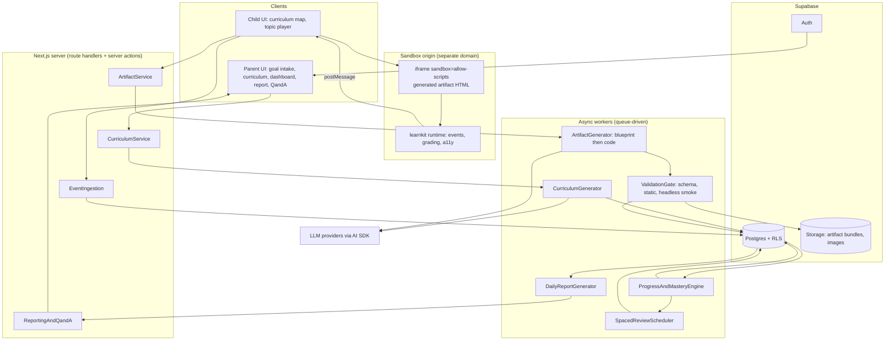
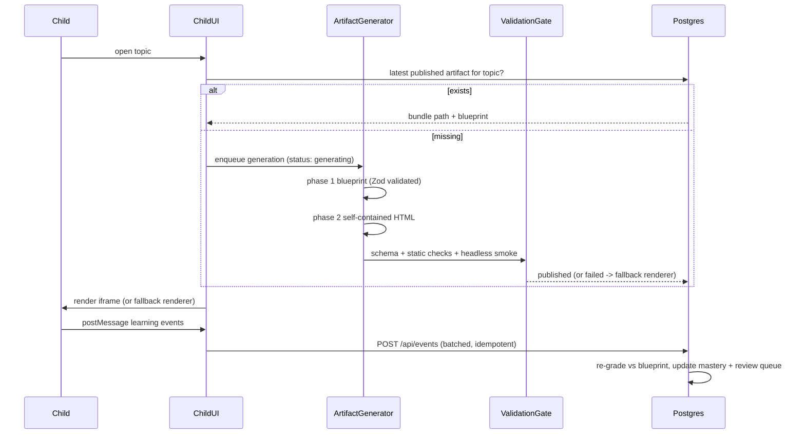

ně# AI Learning App — System Architecture and Tech Stack

Greenfield repo (only [rules.md](rules.md) and [team-split.md](team-split.md) exist). Confirmed decisions: artifacts are **full AI-generated self-contained HTML/JS** run in a sandboxed iframe with a postMessage event bridge; stack is **Next.js + Supabase + Vercel**.

## Core architectural idea: blueprint + codegen

Free-form codegen alone cannot satisfy section 27 (validated answer keys, factual accuracy) or section 28 (fallbacks). So artifact generation is **two-phase**, and the intermediate artifact is durable:

1. **Blueprint** — structured JSON: objectives, selected stages from the seven-stage framework, activities, every question with its answer key and corrective feedback, mastery signals, expected events. Validated with Zod, fact-checked by a second model pass, stored in Postgres.
2. **Code** — the model writes one self-contained HTML file implementing that blueprint, importing the `learnkit` runtime.

This buys three things: the server can **re-grade authoritatively** from the blueprint (client grades instantly for feedback, server is source of truth), assessment data stays queryable for mastery and reports, and the blueprint **doubles as the failure fallback** — a small React renderer draws a plainer-but-complete lesson when codegen or validation fails, so progress never stalls (section 28).

## System architecture

The separation matches section 26 exactly, and the UI never computes long-term progress — mastery is recomputed server-side on event ingest.

## Sandbox and safety model

- Artifacts are served from a **second origin** (e.g. `artifacts.<domain>`, its own Vercel project) so generated JS can never reach app cookies, tokens, or `localStorage`.
- `<iframe sandbox="allow-scripts">` without `allow-same-origin` (opaque origin), plus a strict CSP on the served bundle: `default-src 'none'; script-src 'self' 'unsafe-inline'; img-src 'self' data: <storage-host>; connect-src 'none'`. No network egress from artifacts; all data flows through `postMessage`.
- Host verifies `event.origin` and a per-session nonce before accepting any event.
- `srcdoc` is the local-dev fallback so contributors don't need two domains running.

## Artifact lifecycle

Generation is **asynchronous with pre-warming**: when a child starts a curriculum, the next 1–2 topics generate in the background, so opening a topic is usually instant. A visible "building your lesson" state covers cold starts.

## Tech stack

**Frontend**
- Next.js 15 (App Router, RSC) + React 19 + TypeScript strict
- Tailwind CSS v4; shadcn/ui for the parent dashboard; a separate child design-token set (larger type, higher contrast, touch targets) for the child shell
- Framer Motion in the app shell only; artifacts animate themselves with vanilla CSS/SVG/Canvas inside the sandbox (no heavy deps, section 20 technical requirements)

**AI layer**
- Vercel AI SDK for provider abstraction; Anthropic Claude for artifact codegen (strongest at self-contained interactive HTML), a cheaper/faster model for curriculum generation, report prose, and the fact-check pass
- Zod schemas for every model input/output; structured output for blueprints
- Prompt templates versioned in `packages/ai/prompts/` with a `prompt_hash` recorded on each artifact for traceability (section 18)

**Backend / data**
- Supabase: Postgres 17, Auth, Storage, Row Level Security, `pg_cron`
- Postgres-backed job queue (`generation_jobs`) drained by a Next.js worker route, kicked directly on enqueue and swept by Vercel Cron; Inngest is the upgrade path if retry/fan-out gets complex
- Deterministic aggregation in SQL views; the LLM only writes prose over numbers it is handed

**Quality**
- Vitest for pure logic (mastery, grading, scheduler)
- Playwright + axe-core as the artifact validation gate and for e2e
- Sentry + a `generation_traces` table for generation failures (section 28)

## Data model (key tables)

- `children` (age, reading_level) and `personalization_context` (kind, value, active) — interests stored as reusable structured context, not prompt strings (section 3.2)
- `curricula`, `topics` (stable slug id, order, difficulty, prerequisites), `learning_objectives` as **first-class rows** — mastery is tracked per objective, not per topic
- `artifacts` (topic_id, version, status, `blueprint jsonb`, bundle_path, model, prompt_hash, `validation_report jsonb`) — new versions never delete old ones (section 18)
- `artifact_sessions`, `learning_events` (append-only, `client_event_id` unique for idempotency), `responses` (server-graded correctness, attempt, hints_used, latency)
- `objective_evidence` -> `topic_mastery`, `review_queue`, `generation_jobs`, `daily_reports`
- RLS: parents access only their own children's rows. **No child accounts** — the child surface runs under the parent session with an active `child_id` in a signed cookie, and policies check that the child belongs to the caller. Less PII collected (section 14).

## Mastery and review

Explainable, not a black box (section 22): per-objective evidence weighted by item difficulty, penalised for hints/reveals, rewarded for unaided first attempts and for correct answers **after a delay**, and "mastered" requires evidence from **at least two distinct activity types**. Time-on-task is recorded but never a mastery input (section 9). Review scheduling is SM-2-lite over objectives, suppressed when mastery is already high (section 10).

## Repo structure (pnpm workspaces)

- `apps/web` — parent + child Next.js app
- `apps/sandbox` — artifact host origin: serves bundles + `learnkit`
- `packages/contracts` — Zod schemas for blueprint, events, and ID formats (the shared integration contract, team-split items 1–3)
- `packages/learnkit` — in-artifact runtime: event emitter, grading helpers, a11y/reduced-motion primitives
- `packages/renderer` — React fallback renderer over a blueprint
- `packages/ai` — prompts and generation pipelines
- `packages/db` — migrations + generated types
- `packages/mastery` — pure mastery and scheduling functions

Ownership maps onto [team-split.md](team-split.md): P1 owns parent routes + curriculum + reports + Q&A, P2 owns `packages/ai` + validation gate + versioning, P3 owns the child surface + `learnkit` visuals + `renderer` + a11y/safety, P4 owns `packages/db` + `contracts` + events + mastery + the queue.

## Build order

`packages/contracts` lands first (everything else depends on the blueprint and event schemas), then the database and a hand-written sample artifact to prove the sandbox bridge end to end before any AI is wired in.