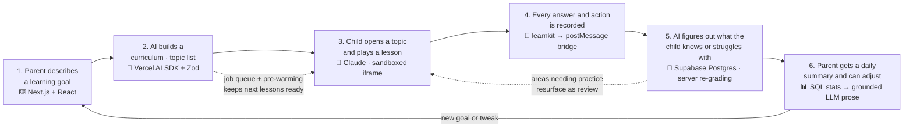
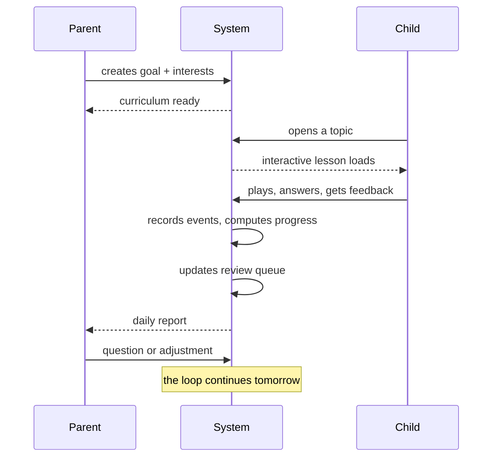
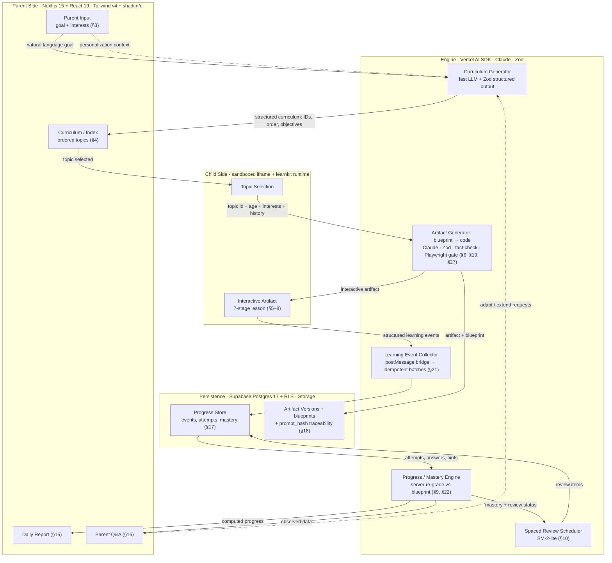

# How the App Works — Workflow

Based on [rules.md](rules.md). Written for everyone: the story in plain words, the technology that powers each step, and the full technical picture for engineers in the appendix.

---

## 1. The Big Idea: One Simple Loop

The whole system is a loop between three players — a parent, a child, and the AI engine. Each step is labeled with the technology that powers it:

That's the product — the story on top of each node, the machinery underneath. Below: how each step happens, the technology in detail, and where the real complexity hides.

---

## 2. The Story, Step by Step

**Step 1 — The parent talks, the AI listens.**
"I want my child to learn about the planets." "My kid loves dinosaurs." No forms, no prompting skills. *(§3)*

**Step 2 — Goal in, table of contents out.**
The AI turns the goal into a structured curriculum — like a book's chapters: *What is space? → The Sun → Mercury → … → Review*. Each topic has a name, an ID, learning objectives, and a difficulty. *(§4)*

**Step 3 — Each topic becomes its own mini-app.**
When the child opens a topic, the AI generates a unique interactive lesson — not a page of text: animations, diagrams, flashcards, quizzes, games. The lesson walks the child through seven stages: **Discover → Understand → Recognize → Practice → Apply → Explain → Master.** *(§5–§8)*

**Step 4 — The lesson watches nothing, records everything (that matters).**
Not surveillance — structure. Each meaningful action (answered a question, used a hint, rewatched an animation) becomes one small structured event with an ID, a result, and a timestamp. *(§21)*

**Step 5 — The system computes what learning actually happened.**
Progress is judged from many signals together: correctness, first-try success, hints needed, variety of activities, performance days later. One rule stands above all: **time spent is never treated as proof of learning.** Mastery is an evidence-based level — not a quiz score. *(§9, §22)*

**Step 6 — Everyone sees what matters.**
The child sees friendly progress. The parent gets a daily plain-language summary: what was completed, where the child struggled, what to review next. Struggling topics quietly resurface as short reviews; mastered ones are skipped. *(§10, §15)*

---

## 3. The Technology Behind Each Step

Every step of the loop runs on concrete, named technology — nothing is hand-waved:

| Step | What happens | Powered by |
|---|---|---|
| 1. Parent describes a goal | Plain-language input and dashboard | **Next.js 15 + React 19** web app, **Tailwind v4 + shadcn/ui** |
| 2. AI builds the curriculum | Goal → structured topic list, validated before saving | **Vercel AI SDK** → fast LLM with **Zod** structured output |
| 3. Topic becomes a lesson | Two-phase generation: blueprint → self-contained interactive HTML | **Anthropic Claude** codegen; blueprint fact-checked by a second model pass; lesson runs in a **sandboxed iframe** on its own domain |
| 4. Actions become events | The lesson emits structured events from inside the sandbox | **learnkit** in-iframe runtime → **postMessage bridge** (origin + nonce verified) → batched, idempotent `/api/events` |
| 5. Progress & mastery computed | Server re-grades answers against the blueprint, updates mastery | **Supabase Postgres 17** with **Row Level Security**; deterministic **SQL views**; logic tested with **Vitest** |
| 6. Parent sees results | Daily report and Q&A answers | SQL-computed stats + LLM prose **grounded in those numbers only**; cron delivery per parent's timezone |

### The stack at a glance

| Layer | Technology |
|---|---|
| Web app (parent + child) | Next.js 15 (App Router) · React 19 · TypeScript · Tailwind CSS v4 · shadcn/ui · Framer Motion (app shell only) |
| AI generation | Vercel AI SDK (provider abstraction) · Anthropic Claude (artifact codegen) · fast/cheap model (curriculum, reports, fact-check) · Zod for every model input/output |
| Data & persistence | Supabase: Postgres 17 · Row Level Security · Storage (artifact bundles) · Auth · pg_cron |
| Async generation | Postgres-backed job queue (`generation_jobs`) → Next.js worker route, kicked on enqueue + Vercel Cron sweep; next topics pre-warmed in the background |
| Quality & safety | Vitest (pure logic) · Playwright + axe-core (artifact validation gate) · Sentry + generation traces (failure debugging) |

---

## 4. ⚡ Where the Complexity Actually Lives

Four deliberate hard parts — this is the depth behind the simple loop:

| | Hard part | Why it's hard | How it's handled |
|---|---|---|---|
| ⚡ | **Generating lessons that are always correct** | AI can confidently write wrong facts or broken quizzes | A **Zod-validated blueprint** with verified answer keys and a second-model fact-check comes first; every finished artifact passes a **Playwright + axe-core** smoke test. *(§27)* |
| ⚡ | **The lesson must be safe and isolated** | AI-generated code runs on a child's screen | Artifacts run in a **sandboxed iframe on a separate origin** with a strict CSP — `connect-src 'none'`: zero network access from lesson code. *(§13, §14)* |
| ⚡ | **Progress must be honest** | A perfect quiz score can hide memorization | The **server re-grades every answer against the blueprint's answer keys**; mastery requires evidence across activity types, unaided answers, and delayed recall. *(§22)* |
| ⚡ | **Nothing may ever be lost** | Lessons get improved and regenerated | Every artifact is **versioned in Postgres** with its blueprint and `prompt_hash`; the child's history carries forward — regeneration never erases progress. *(§17, §18)* |

---

## 5. One Day in the System

The loop from the inside — what happens from morning to report:

---

## 6. If Something Breaks

The system is built so a failure never stops learning:

| If this fails | The system does this |
|---|---|
| A lesson can't be generated | Shows a fallback state; parent/child can retry |
| An animation fails | Replaced by a static visual |
| A complex game breaks | Replaced by a simpler equivalent activity |
| A lesson is regenerated | Old version kept; the child's progress is never erased |

**Learning continues even when an individual component fails.** *(§28)*

---

## Appendix: The Full Technical Pipeline

For engineers — every subsystem and handoff, per section 26 of the spec, with the technology each part runs on. The UI never computes progress; it only emits events. Each arrow below is a defined contract.

**Handoff contracts in brief:**

1. **Parent input → Curriculum generator:** plain language + personalization in → ordered topic tree with stable IDs, objectives, prerequisites out. *(§3 → §4)*
2. **Topic open → Artifact generator:** topic ID, child age/reading level, prior knowledge, interests, previous performance. Existing artifact? Load it. Missing? Generate. *(§4 → §5)*
3. **Artifact generation:** blueprint first (validated answer keys, fact-checked) → then the self-contained lesson → published with a version number. *(§6, §19–20, §18)*
4. **Child interaction → Events:** every meaningful action becomes a typed event (`question_answered`, `hint_requested`, `quiz_completed`, …) carrying IDs, correctness, attempt count, hint usage, timestamp. *(§21)*
5. **Events → Progress/Mastery:** multi-signal computation (accuracy, independence, variety, recency, objective coverage); time-on-task recorded but never decisive. *(§9, §22)*
6. **Mastery → Review + Reports:** slipping topics re-enter review (flashcards, short quizzes, previously-wrong questions); mastered topics are skipped. Reports are generated strictly from computed data — never unsupported conclusions. *(§10, §15, §16)*
7. **Q&A → Curriculum:** parent requests adapt the curriculum without regenerating what's already learned. *(§16 → §3)*
